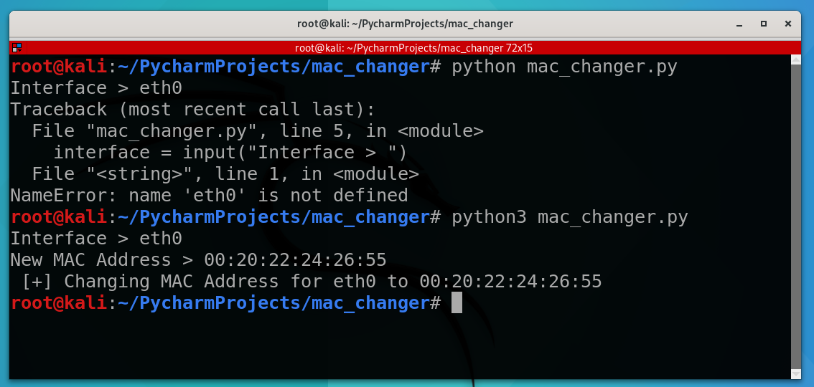
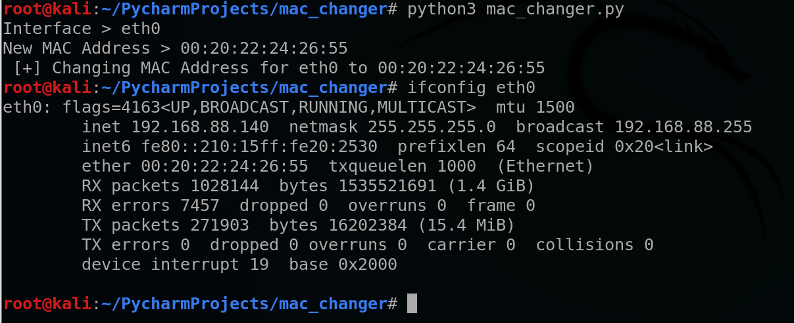

# MAC Address Changer

A Python command-line tool that changes the MAC address of a Linux network interface. Built as a hands-on project in a self-built Kali Linux home lab, as part of ongoing cybersecurity self-study covering Python scripting, Linux networking, and system administration fundamentals.

## What it does

The script prompts for a network interface (e.g. `eth0`) and a new MAC address, then:
1. Brings the interface down
2. Sets the new MAC address using `ifconfig`
3. Brings the interface back up

## Why I built this

MAC address spoofing is a foundational networking/security concept — it's used for privacy on untrusted networks, testing MAC-based access controls, and understanding how devices are identified at the link layer. Building it from scratch was a way to get hands-on with Linux networking commands, `subprocess` in Python, and basic CLI tool design.

## Requirements

- Linux (tested on Kali Linux)
- Python 3
- `net-tools` package installed (provides `ifconfig`)
- Root privileges

## Usage

```bash
sudo python3 mac_changer.py
```

You'll be prompted for:
```
Interface > eth0
New MAC Address > 00:11:22:33:44:55
```

Verify the change with:
```bash
ifconfig eth0
```

## Example

```
$ sudo python3 mac_changer.py
Interface > eth0
New MAC Address > 00:21:31:41:51:61
 [+] Changing MAC address for eth0 to 00:21:31:41:51:61
```

## Demo

Running the script and entering an interface and new MAC address:



Verifying the change took effect with `ifconfig`:



## Known Limitations / Security Notes

This is a learning project and currently has no input validation, which I identified while building it:

- **No format checking** on the interface name or MAC address — invalid input can cause the underlying `ifconfig` commands to fail silently or behave unexpectedly.
- **Command injection risk** — because user input is concatenated directly into a shell command (`shell=True`), a malicious user could enter Linux commands instead of an interface name or MAC address, and those commands would be executed on the system.

These are deliberate discoveries from testing the tool, not oversights I'm unaware of — documenting them here as part of understanding secure coding practices.

## Planned Improvements

- [ ] Validate MAC address format with a regex before use
- [ ] Validate that the interface actually exists before attempting changes
- [ ] Replace raw string concatenation + `shell=True` with a safer subprocess call (e.g. passing args as a list, `shell=False`)
- [ ] Add a `--random` flag to generate a random valid MAC address
- [ ] Add error handling for missing permissions or missing `ifconfig`
- [ ] Migrate from `ifconfig` (deprecated) to `ip link` for modern Linux compatibility

## Background

Originally built using manual `ifconfig` commands to understand the underlying mechanism, then automated into a Python script with hardcoded values, and finally extended to accept user input for the interface and MAC address interactively.
